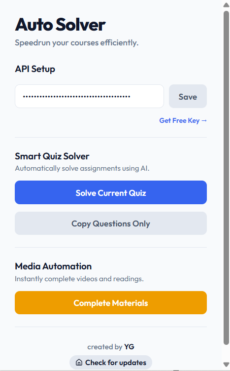

> [!CAUTION]
> ### ⚠️ Disclaimer: For Educational Purposes Only
> This extension was created strictly for **educational and learning purposes** to explore browser extension development, DOM manipulation, and API interception. 
> 
> * **No Liability:** The creator of this extension is not responsible for any consequences that may arise from using this tool.
> * **Academic Integrity:** Coursera has strict policies regarding academic integrity. Using this tool to automatically complete courses or solve quizzes may violate Coursera's Terms of Service and Honor Code.
> By using this open-source software, you agree that you are taking full responsibility for your own actions.

# Coursera Auto Solver 🎓

  
  
<em>Speedrun your courses smoothly</em>

🎬 **[Watch the Demo on YouTube](https://www.youtube.com/watch?v=a060UX8dlHE)**

A sleek, lightweight Chrome Extension to automate and help you navigate your Coursera courses with ease. 

## ✨ Features

* **⚡ Media Auto-Completer:** Instantly mark all videos, readings, and supplements as complete in the background. No API key or setup required!
* **📋 Question Extractor:** Neatly extracts all quiz and assignment questions from the page into a clean format so you can easily copy them. No API key needed!
* **🤖 Smart Quiz Solver:** Automatically solves multiple choice and text-input quizzes silently and instantly using a Google Gemini AI key.

## 🚀 How to Use

### 1. Install the Extension
1. Clone or download this repository to your local machine.
2. Open Google Chrome and navigate to `chrome://extensions/`.
3. Enable **Developer mode** (toggle in the top right corner).
4. Click **Load unpacked** and select the folder containing this extension's files.

### 2. Configure and Run 
1. Navigate to any Coursera course page inside the `/learn/` path.
2. Click the **Coursera Auto Solver** icon in your Chrome toolbar.
3. Automatically mark all videos as complete by clicking **Complete Section Materials**, or extract questions by clicking **Copy All Questions**.
4. To automatically solve quizzes directly within your browser, get a free Google Gemini API key from [Google AI Studio](https://ai.google.dev/aistudio), paste it into the UI, click **Save Key**, and then click **Solve Current Quiz**.

***

## 🔧 Fixes & Improvements — Enhanced by Xavi

### Bugs Fixed

- **AI solver was completely broken** — it was pointing at a Gemini model name that doesn't exist, so it never worked out of the box
- **Auth tokens from XHR requests were silently dropped** — headers were never actually being captured, so the completion feature would fail depending on how Coursera made its requests
- **Page would freeze** when completing a course because of blocking `alert()` calls
- **Clicking "Copy Questions" while it was loading** did nothing and gave no feedback — no loading state at all
- **Error messages were useless** — everything just said "Failed to fetch from AI" regardless of what actually went wrong (rate limit, bad key, network issue, etc.)
- **CSRF token was being broadcast to every script on the page** — a security issue where the auth token could be read by third-party scripts running on Coursera
- **Question scraping used hardcoded CSS class names** that Coursera regenerates on every deploy — the scraper would randomly break after a site update
- **Gemini sometimes returns its JSON wrapped in text** and the extension would just crash instead of retrying
- **All buttons were enabled even on non-Coursera pages** — clicking them would just fail silently
- **Saving an empty API key would wipe your existing one**
- **Extracted questions showed raw JSON** instead of something readable
- **"Already answered correctly" detection had a false positive** — it would sometimes skip applying answers when it shouldn't
- **Auto-submit didn't fire when using preview mode**
- **Per-week module filter was broken** — IDs were being HTML-escaped before comparison so nothing would match

### What Was Added

- **Upgraded to Gemini 2.5 Pro** for smarter, more accurate answers
- **Token readiness indicator** — green/yellow/red dot so you know before clicking if the completion feature is ready
- **Show/hide API key button** and a **clear key button**
- **5 settings toggles** that save across sessions:
  - Auto-submit the quiz after answers are applied
  - Add an explanation for why each answer is correct
  - Preview answers before they get applied to the page
  - Per-week completion — pick which weeks to complete instead of the whole course
  - Generate ADHD study notes after completing
- **Preview mode** — see what the AI decided before it fills anything in, with an Apply or Discard button
- **Answer explanations** — the AI tells you why each answer is correct, useful if you actually want to learn
- **Per-week completion** — loads your course structure and lets you check/uncheck specific weeks
- **ADHD-friendly notes** — after completing, fetches the reading content and generates clean structured notes (key points, TL;DRs, "why this matters" callouts) that open in a new tab with a Print/PDF option
- **Dismiss button on the page banner** — you can close it instead of waiting for it to fade
- **Desktop notification** when the completion loop finishes, so you don't have to keep the tab open and stare at it
- **Locked items count** in the completion banner so you know what got skipped
- **Session expiry detection** — if your login expires mid-completion it stops and tells you to refresh instead of failing silently
- **Rate limit detection** — clear message when you've hit the Gemini API quota instead of a cryptic crash
- **Re-solve detection** — if a quiz is already correctly answered it skips instead of clicking everything again

***

## ✨ v2 Update — Multi-Provider AI & Full Overhaul

### New in v2

- **Multi-provider AI support** — choose between 5 providers from the popup:
  - **Gemini** (free) — Google AI Studio
  - **Groq** (free) — blazing-fast inference
  - **OpenAI** (paid) — GPT-4o and GPT-4o mini
  - **Claude** (paid) — Anthropic's models
  - **OpenRouter** (free tier available) — access to dozens of models including Llama 3.3
- **Model selector** — pick the specific model per provider (e.g. `gemini-2.5-pro`, `llama-3.3-70b-versatile`, `gpt-4o-mini`)
- **Backward compatible** — existing Gemini keys continue to work with no changes needed
- **Reorganized popup** into 3 clean tabs: **Solver**, **Automate**, **Settings**
- **Complete Materials Only** and **Complete Everything (AI)** buttons now reliably mark all videos, readings, and supplements complete — fires both the video-events and supplement-completions API in parallel batches
- **Walk-Away Mode** — queue multiple courses and walk away; the extension completes them one after another automatically
- **Quiz Pilot** — navigates to every graded quiz in the course and solves them sequentially
- **Specialization complete** — completes every course in a Coursera Specialization in one click
- **Speed-Run Analyzer** — shows total items, required quizzes, skippable readings, and estimated time
- **Flashcard generator** — fetches reading content and generates study flashcards that open in a viewer tab
- **Peer Review filler** — reads the rubric and submission, generates thoughtful review text for each criterion
- **Forum Post writer** — generates a natural, student-voice discussion post for the current prompt
- **Code Solve** — detects the programming language and generates working code for assignments
- **AI Tutor** — floating chat panel on every course page; uses the video transcript or reading content as context
- **Ask About This Video** — fetches the lecture transcript and lets you ask specific questions about it
- **ADHD Notes** — generates structured, ADHD-optimized HTML study notes from reading content after completion
- **Human-style writing mode** — essay and text answers written in a natural first-person student voice
- **Per-week completion** — load your course weeks and check/uncheck which ones to complete
- **Custom instructions** — persistent text prompt injected into every AI request (e.g. "answer in Spanish")

### How to Use the Multi-Provider Setup

1. Open the extension popup on any Coursera page
2. Click a provider pill at the top (**Gemini**, **Groq**, **OpenAI**, **Claude**, or **OpenRouter**)
3. Click **Get Free Key →** to go directly to that provider's API key page
4. Paste your key and click **Save**
5. Optionally pick a model from the dropdown — the default is already the best free/fast option for each provider
6. The selected provider is remembered — switching tabs or reopening the popup keeps your choice

***

Created by [YG](https://github.com/Youssef-Ghafir) — Enhanced by Xavi